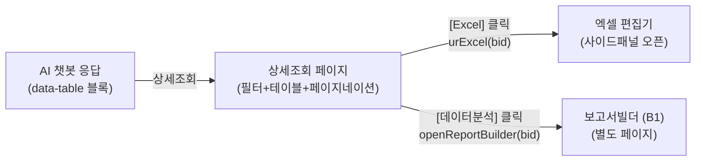
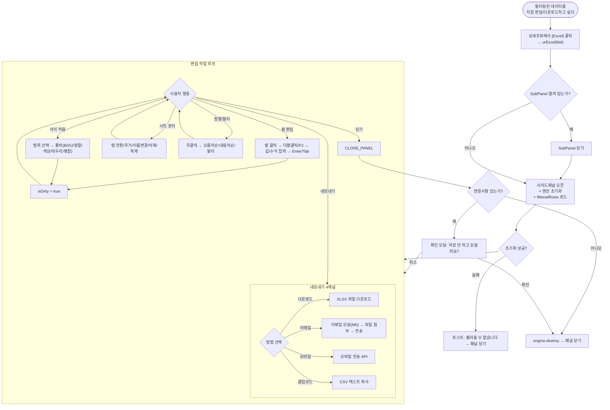

# BranchQ 엑셀 편집기 업무흐름도

> 버전: 2.0 | 작성일: 2026.04.10
> 참조: 05_excel_editor_v1.md, Figma DESC-상세조회(214:2)

---

## 1. 사용 의도

엑셀 편집기는 **상세조회 페이지에서 [Excel] 버튼을 클릭하면 열리는 사이드패널**로, 필터링된 데이터를 직접 셀 단위로 편집하고 XLSX로 다운로드하는 기능이다. 보고서빌더(분석기)와는 별도의 기능이다.

| 사용 동기 | 예시 |
|----------|------|
| 데이터 직접 수정 | 부서명 오류, 금액 보정, 비고 메모 추가 |
| 추가 계산 | SUM/AVERAGE 수식으로 합계/평균 산출 |
| 서식 적용 | 중요 수치 빨간 볼드, 배경색 강조 |
| XLSX 다운로드 | 편집한 데이터를 엑셀 파일로 내려받기 |
| 이메일/클립보드 | 편집 결과를 동료에게 직접 전달 |

---

## 2. 진입 경로



**진입:** 상세조회 페이지 → [Excel] 버튼 → `urExcel(bid)` → 사이드패널 오픈
- `window._urData[bid].filteredRows` 데이터가 스프레드시트에 로드됨

---

## 3. 메인 업무흐름도



---

## 4. 상세조회와의 연동

### 상세조회 페이지 이벤트 흐름 (피그마 기준)
| 순서 | 행동 | 함수 | 결과 |
|------|------|------|------|
| 1 | 날짜 입력 + 기간내역조회 클릭 | `urSearch(bid)` | filteredRows 갱신 |
| 2 | 페이지당 건수 변경 (5/10/20/50) | 자동 | 페이지 리셋 |
| 3 | **[Excel] 클릭** | **`urExcel(bid)`** | **사이드패널 오픈** |
| 4 | [데이터분석] 클릭 | `openReportBuilder(bid)` | 보고서빌더 이동 |
| 5 | 페이지네이션 | `urPage(bid, page)` | 페이지 전환 |

### 데이터 바인딩
```
window._urData[bid].columns      → 테이블 헤더 → 스프레드시트 열
window._urData[bid].filteredRows  → 필터 결과 → 스프레드시트 행
```

---

## 5. 핵심 동작 규칙

### 패널 공존 규칙
- Excel 패널과 SubPanel은 **동시 오픈 불가**
- Excel 오픈 시 → SubPanel 자동 닫기

### 키보드 단축키
| 단축키 | 동작 | 단축키 | 동작 |
|--------|------|--------|------|
| Ctrl+C/V/X | 복사/붙여넣기/잘라내기 | Ctrl+B/I/U | 굵게/기울임/밑줄 |
| Ctrl+Z/Y | 되돌리기/다시실행 | F2 | 편집 모드 진입 |
| Tab | 다음 셀 이동 | Enter | 아래 셀 이동 |
| Escape | 편집 취소 | Shift+화살표 | 범위 선택 |

### 역할 분담
| 외부 엔진(SpreadJS 등) | React 레이어 |
|----------------------|-------------|
| 셀 편집, 수식, 서식, 선택/드래그 | 패널 열기/닫기, SubPanel 상호배타 |
| 복사/붙여넣기, Undo/Redo | 툴바/수식바/시트탭 UI |
| 정렬/필터, 멀티시트, 스크롤 | 내보내기 드롭다운, 모달 연동 |
| XLSX import/export | isDirty 추적, engine lifecycle |

---

## 6. 에러 처리

| 상황 | 처리 | 사용자 피드백 |
|------|------|-------------|
| 엔진 초기화 실패 | destroy + 패널 닫기 | 토스트: "불러올 수 없습니다" |
| 수식 오류 | 엔진이 에러값 표시 | 셀에 #REF!, #ERROR! |
| 내보내기 실패 | catch + 로깅 | 토스트: "내보내기 실패" |
| 이메일 전송 실패 | 재시도 가능 | 토스트: "전송 실패" |
| 클립보드 접근 거부 | textarea fallback | 토스트: "접근 거부" |
| 페이지 이탈 (isDirty) | beforeunload 경고 | 브라우저 기본 경고 |

---

## 7. 업무 시나리오

### A. 이상거래 검토 후 공유
```
AI "이상거래 감지" → 상세조회 → 점수 90이상 필터 → [Excel]
→ 비고란에 "검토 완료" 메모 → 빨간 서식 → 이메일 전송
```

### B. 월말 데이터 가공
```
AI "법인카드 현황" → 상세조회 → 2월 필터 → [Excel]
→ 합계 행 추가(SUM) → 서식 적용 → XLSX 다운 → 사내 시스템 업로드
```

### C. 데이터 재사용
```
AI "예적금 현황" → 상세조회 → 만기일 정렬 → [Excel]
→ 불필요 열 삭제 → 클립보드 복사 → PPT 붙여넣기
```
