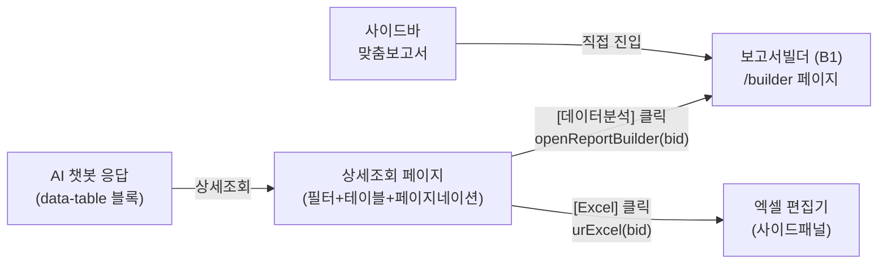
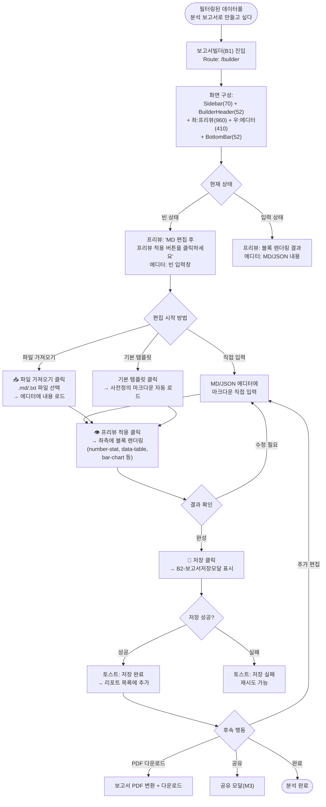
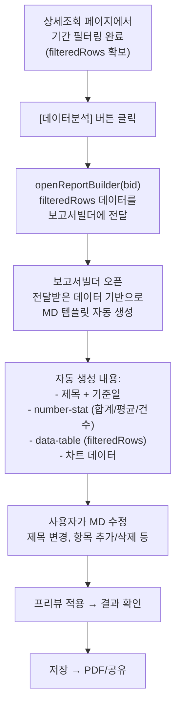

# BranchQ 엑셀 분석기 (보고서빌더) 업무흐름도

> 버전: 3.0 | 작성일: 2026.04.10
> 참조: Figma B1-보고서빌더(13:115, 60:2), DESC-B1(66:2), DESC-상세조회(214:2)

---

## 1. 사용 의도

엑셀 분석기는 **상세조회 페이지에서 필터링된 데이터를 보고서빌더(B1)에서 MD/JSON으로 편집하여 그래프+테이블+통계를 조합한 분석 보고서를 만드는** 기능이다. 엑셀 편집기(사이드패널)와는 별도의 전용 페이지이다.

| 사용 동기 | 예시 |
|----------|------|
| 데이터 시각화 | 필터링된 자금 데이터를 차트+통계 카드로 변환 |
| 보고서 작성 | MD 편집으로 제목/본문/테이블/차트를 조합한 정형 보고서 생성 |
| 템플릿 활용 | 기본 템플릿으로 빠르게 보고서 구조 생성 |
| 외부 파일 활용 | .md/.txt 파일 가져와서 보고서 내용 채우기 |
| 보고서 저장/배포 | 완성된 보고서를 저장 → PDF/공유/이메일 배포 |

---

## 2. 진입 경로



**두 가지 진입 경로:**
1. 상세조회 페이지 → [데이터분석] 버튼 → `openReportBuilder(bid)` → 보고서빌더 오픈
2. 사이드바 → 맞춤보고서 → 보고서빌더 직접 진입

---

## 3. 메인 업무흐름도



---

## 4. 보고서빌더 화면 상세 (피그마 기준)

### 레이아웃
```
┌──────┬──────────────────────────────────────────────┐
│      │ BuilderHeader (52px)                         │
│      │ "✏️ 보고서 빌더"  [📝 MD 편집]              │
│ Side ├──────────────────────┬───────────────────────┤
│ bar  │ PreviewArea (960px)  │ EditorPanel (410px)   │
│ (70) │                      │ "MD / JSON 편집" 328글자│
│      │ ┌──────────────────┐│ [📥 파일 가져오기][기본 템플릿]│
│      │ │ 프리뷰 결과      ││ ┌─────────────────────┐│
│      │ │ (블록 렌더링)    ││ │ # 자금현황          ││
│      │ │ number-stat      ││ │ ## 기준일           ││
│      │ │ data-table       ││ │ | 회사 | 통화 | 금액 ││
│      │ │ bar-chart ...    ││ │ |---|---|---|       ││
│      │ └──────────────────┘│ └─────────────────────┘│
│      ├──────────────────────┴───────────────────────┤
│      │ BottomBar: [👁 프리뷰 적용] [💾 저장]       │
└──────┴──────────────────────────────────────────────┘
```

### 컴포넌트 구조 (React)
```
<BuilderView>
  <Sidebar />
  <BuilderHeader tabs={['md']} />
  <BuilderContent>
    <PreviewArea rendered={blocks} />
    <EditorPanel>
      <FileImportBtn />     ← .md/.txt 파일 가져오기
      <TemplateBtn />       ← 기본 템플릿 로드
      <MarkdownEditor />    ← MD/JSON 텍스트 편집
    </EditorPanel>
  </BuilderContent>
  <BuilderBottomBar>
    <ApplyPreviewBtn />     ← MD → 블록 렌더링
    <SaveBtn />             ← B2-저장 모달
  </BuilderBottomBar>
</BuilderView>
```

### 상태 2가지
| 상태 | 에디터 | 프리뷰 |
|------|-------|--------|
| 빈 상태 | 빈 입력창 | "MD 편집 후 프리뷰 적용 버튼을 클릭하세요" |
| 입력 상태 | MD/JSON 텍스트 | 블록 렌더링 결과 (number-stat, data-table 등) |

---

## 5. 상세조회 → 분석기 연동 흐름



---

## 6. 에러 처리

| 상황 | 처리 | 사용자 피드백 |
|------|------|-------------|
| 파일 가져오기 형식 오류 | .md/.txt 외 파일 차단 | "지원하지 않는 파일 형식입니다" |
| MD 파싱 실패 | 프리뷰에 원본 텍스트 표시 | 토스트: "마크다운 변환 실패" |
| 프리뷰 렌더링 실패 | 에러 블록만 스킵 | 정상 블록은 표시 |
| 저장 실패 | 재시도 가능 | 토스트: "저장 실패" |
| 데이터 전달 실패 | 빈 상태로 빌더 오픈 | 직접 입력 안내 |

---

## 7. 업무 시나리오

### A. 상세조회 → 분석 보고서 생성
```
AI "법인카드 현황" → 상세조회 → 2월 필터링 → [데이터분석]
→ 보고서빌더에 데이터 자동 로드 → MD 수정 → 프리뷰 → 저장 → PDF 다운
```

### B. 템플릿으로 정기 보고서
```
사이드바 "맞춤보고서" → 보고서빌더 → 기본 템플릿 로드
→ 데이터 수정 → 프리뷰 적용 → 저장
```

### C. 외부 파일 기반 보고서
```
보고서빌더 → 📥 파일 가져오기 → 기존 .md 파일 로드
→ 수정/보완 → 프리뷰 → 저장 → 이메일 공유
```
