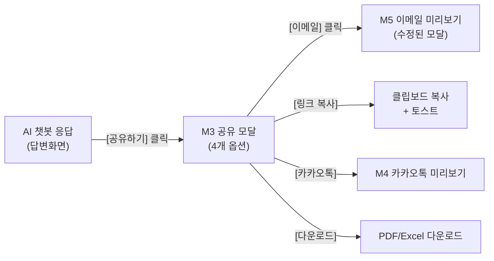
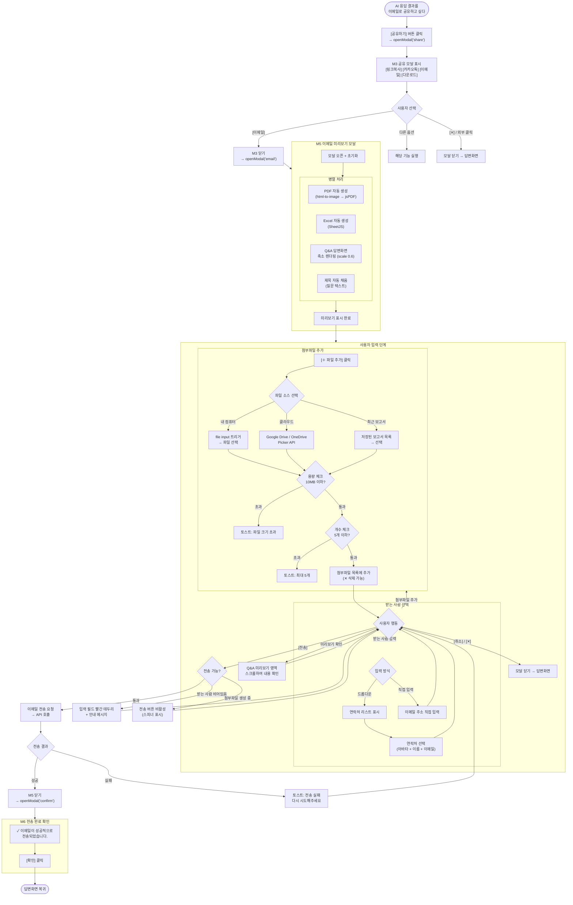
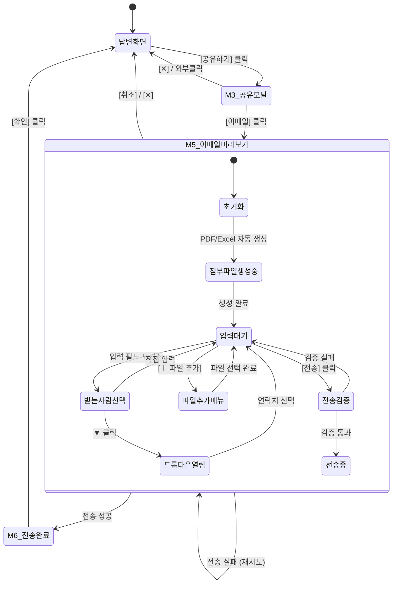
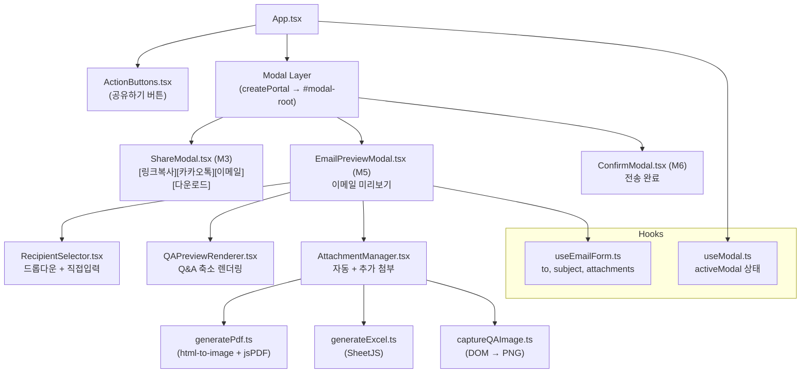
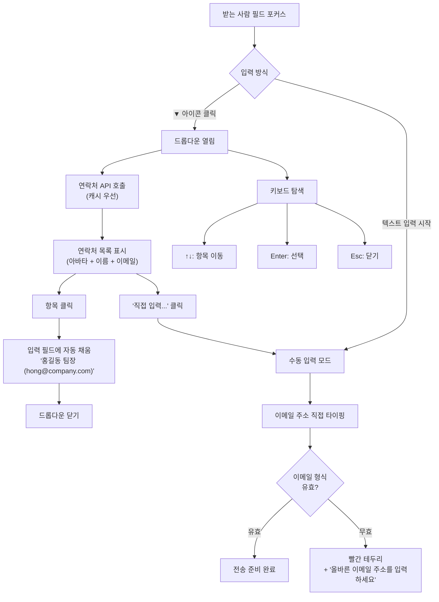

# BranchQ 이메일 미리보기 및 전송 업무흐름도

> 버전: 1.0 | 작성일: 2026.04.10
> 참조: 03_design_spec_v2.md (M3/M5/M6), Figma 4. 공유 기능 개발 페이지

---

## 1. 사용 의도

이메일 전송 기능은 **AI 챗봇 응답(Q&A 답변) 전체를 이메일로 공유**하는 기능이다. 기존 textarea 기반의 단순 전송에서, Q&A 화면 전체 렌더링 + PDF/Excel 자동 첨부로 개선한다.

| 사용 동기 | 예시 |
|----------|------|
| 분석 결과 공유 | 예적금 현황 리포트를 팀장에게 이메일 전송 |
| 보고서 전달 | AI 생성 보고서를 PDF 첨부하여 상사에게 보고 |
| 데이터 전달 | 계좌 테이블 데이터를 Excel 첨부하여 동료에게 전달 |
| 외부 공유 | 고객사에 분석 결과 HTML 이메일 + 첨부파일 전송 |

---

## 2. 진입 경로



**진입:** 답변화면 → [공유하기] → M3 공유 모달 → [이메일] → M5 이메일 미리보기 모달

---

## 3. 메인 업무흐름도



---

## 4. 상태 다이어그램



---

## 5. 컴포넌트 구조



---

## 6. 데이터 흐름

### 6.1 이메일 전송 데이터 구조

```typescript
interface EmailPayload {
  to: string;                    // 받는 사람 이메일
  subject: string;               // 제목 (질문 텍스트 기반)
  htmlBody: string;              // HTML 렌더링된 Q&A 답변 전체
  attachments: EmailAttachment[];
}

interface EmailAttachment {
  filename: string;              // "브랜치Q_예적금현황.pdf"
  mimeType: string;              // "application/pdf"
  blob: Blob;                    // 파일 바이너리
  size: number;                  // 바이트
  source: 'auto' | 'user';      // 자동생성 vs 사용자추가
  removable: boolean;            // 삭제 가능 여부
}
```

### 6.2 받는 사람 연락처 구조

```typescript
interface Contact {
  id: string;
  name: string;                  // "홍길동 팀장"
  email: string;                 // "hong@company.com"
  department?: string;           // "자금관리팀"
  avatar?: string;               // 프로필 이미지 URL
}

interface RecipientState {
  mode: 'dropdown' | 'manual';   // 입력 방식
  selectedContact: Contact | null;
  manualEmail: string;
  isDropdownOpen: boolean;
  contacts: Contact[];           // API에서 로드
}
```

### 6.3 첨부파일 상태 구조

```typescript
interface AttachmentState {
  autoAttachments: AttachmentItem[];   // PDF, Excel (자동 생성, 삭제 불가)
  userAttachments: AttachmentItem[];   // 사용자 추가 (삭제 가능)
  isAddMenuOpen: boolean;
  generating: {
    pdf: boolean;
    excel: boolean;
  };
}

interface AttachmentItem {
  id: string;
  filename: string;
  mimeType: string;
  size: number;
  blob: Blob | null;
  status: 'generating' | 'ready' | 'error';
  source: 'auto-pdf' | 'auto-excel' | 'local' | 'cloud' | 'report';
}
```

---

## 7. 자동 첨부파일 생성 흐름

### 7.1 PDF 생성


### 7.2 Excel 생성


---

## 8. 사용자 첨부파일 추가 흐름

```mermaid
flowchart TD
    CLICK["[＋ 파일 추가] 클릭"] --> MENU["파일 추가 메뉴 표시"]

    MENU --> LOCAL["📁 내 컴퓨터에서 선택"]
    MENU --> CLOUD["☁️ 클라우드 스토리지"]
    MENU --> REPORT["📋 최근 보고서에서 선택"]

    LOCAL --> FILE_INPUT["<input type='file'><br/>accept='.pdf,.xlsx,.xls,.csv,.doc,.docx,.ppt,.pptx,.jpg,.png'<br/>multiple"]
    CLOUD --> PICKER["Google Picker API<br/>/ Microsoft Graph API"]
    REPORT --> REPORT_LIST["저장된 보고서 목록<br/>→ 항목 선택"]

    FILE_INPUT --> VALIDATE
    PICKER --> VALIDATE
    REPORT_LIST --> VALIDATE

    VALIDATE{검증}

    VALIDATE --> SIZE{"파일 크기<br/>≤ 10MB?"}
    SIZE -- 초과 --> TOAST_SIZE["토스트: '파일 크기가 10MB를<br/>초과합니다'"]
    SIZE -- 통과 --> COUNT{"총 개수<br/>≤ 5개?"}
    COUNT -- 초과 --> TOAST_COUNT["토스트: '추가 첨부파일은<br/>최대 5개까지 가능합니다'"]
    COUNT -- 통과 --> ADD["userAttachments에 추가<br/>(✕ 삭제 버튼 표시)"]

    ADD --> UPDATED["첨부파일 목록 갱신"]
```



---

## 9. 받는 사람 선택 흐름



---

## 10. 전송 검증 규칙

| 검증 항목 | 조건 | 실패 시 동작 |
|----------|------|-------------|
| 받는 사람 | 비어있지 않음 | 입력 필드 빨간 테두리 + "받는 사람을 입력하세요" |
| 이메일 형식 | RFC 5322 유효 | "올바른 이메일 주소를 입력하세요" |
| 자동 첨부파일 | 생성 완료 | [전송] 버튼 비활성 + 스피너 |
| 추가 첨부파일 | 10MB 이하, 5개 이하 | 토스트 경고 |

---

## 11. 라이브러리 의존성

| 패키지 | 용도 | 비고 |
|--------|------|------|
| `html-to-image` | DOM → PNG 캡처 | PDF 생성용, pixelRatio:2 |
| `jspdf` | PDF 생성 | A4 포맷 |
| `jspdf-autotable` | PDF 내 테이블 | 데이터테이블 블록용 |
| `xlsx` (SheetJS) | Excel 생성 | XLSX 포맷 |
| `file-saver` | 파일 다운로드 | 브라우저 다운로드 트리거 |

```bash
npm install html-to-image jspdf jspdf-autotable xlsx file-saver
npm install -D @types/file-saver
```

---

## 12. 파일 구조

```
src/
├── components/
│   ├── modals/
│   │   ├── ModalOverlay.tsx            # 공통 오버레이 (createPortal)
│   │   ├── ShareModal.tsx              # M3: [링크복사][카카오톡][이메일][다운로드]
│   │   ├── EmailPreviewModal.tsx       # M5: 이메일 미리보기 (수정안)
│   │   └── ConfirmModal.tsx            # M6: 전송 완료 확인
│   └── email/
│       ├── RecipientSelector.tsx       # 드롭다운 + 직접입력
│       ├── QAPreviewRenderer.tsx       # Q&A 축소 렌더링
│       └── AttachmentManager.tsx       # 자동 + 추가 첨부 관리
├── hooks/
│   ├── useModal.ts                     # activeModal 상태
│   └── useEmailForm.ts                # to, subject, attachments 상태
├── utils/
│   ├── generatePdf.ts                  # Q&A → PDF Blob
│   ├── generateExcel.ts                # 데이터테이블 → XLSX Blob
│   └── captureQAImage.ts              # DOM → PNG data URL
├── types/
│   └── index.ts                        # EmailPayload, Contact, AttachmentState
└── data/
    └── sampleResponse.ts              # 구조화된 응답 JSON
```

---

## 13. 디자인 토큰 참조

| 요소 | 스펙 |
|------|------|
| 모달 오버레이 | `bg-black/50`, `backdrop-blur-[4px]`, `z-50` |
| 모달 컨테이너 | `bg-white`, `rounded-lg`, `shadow-[0_4px_24px_rgba(0,0,0,0.12)]`, `max-w-480`, `p-6` |
| 입력 필드 | `h-36`, `border-gray-200`, `rounded-md`, `px-3` |
| 드롭다운 리스트 | `border-gray-200`, `rounded-lg`, `shadow-md`, `max-h-[240px]`, `overflow-y-auto` |
| 연락처 항목 | `h-40`, `px-3.5`, `hover:bg-gray-50`, 선택 시 `bg-blue-50` |
| 아바타 | `w-7 h-7`, `rounded-full`, `bg-gray-200` (선택: `bg-blue-500`) |
| 버튼(취소) | `border-gray-200`, `rounded-[20px]`, `min-w-[90px]`, `h-9` |
| 버튼(전송) | `bg-primary-blue`, `text-white`, `rounded-[20px]`, `min-w-[90px]`, `h-9` |
| 첨부 자동 | `📄` PDF, `📊` Excel, `🔒` 삭제불가 |
| 첨부 추가 | `📎` 아이콘, `✕` 삭제 버튼 (`bg-red-50`, `text-red-500`) |
| [＋ 파일 추가] | `bg-blue-50`, `text-blue-500`, `rounded-full`, `px-3 py-1.5` |
| 미리보기 영역 | `bg-gray-50`, `border-gray-200`, `rounded-lg`, `h-[280~320px]`, `overflow-y-auto` |
| 폰트 | 한글: Noto Sans KR, 숫자: Inter |

---

## 14. 에러 처리

| 상황 | 대응 |
|------|------|
| PDF 생성 실패 | 토스트: "PDF 생성에 실패했습니다. 다시 시도합니다" → 자동 재시도 1회 |
| Excel 생성 실패 | 토스트: "Excel 생성에 실패했습니다" → 수동 재시도 버튼 |
| 이메일 전송 실패 | 토스트: "전송에 실패했습니다. 다시 시도해주세요" → M5 유지 |
| 연락처 로드 실패 | 드롭다운 비활성 → 직접 입력 모드로 전환 |
| 첨부파일 크기 초과 | 토스트: "파일 크기가 10MB를 초과합니다" |
| 첨부파일 개수 초과 | 토스트: "추가 첨부파일은 최대 5개까지 가능합니다" |
| 네트워크 오류 | 토스트: "네트워크 연결을 확인해주세요" |

---

## 15. 향후 확장

| 기능 | 설명 | 우선순위 |
|------|------|---------|
| 다중 수신자 | 받는 사람 여러 명 선택 (태그 형태) | Phase 2 |
| CC/BCC | 참조/숨은참조 필드 추가 | Phase 2 |
| 이메일 템플릿 | 자주 쓰는 양식 저장/불러오기 | Phase 3 |
| 예약 발송 | 지정 시간에 자동 전송 | Phase 3 |
| 발송 이력 | 보낸 이메일 목록 조회 | Phase 2 |
| 드래그&드롭 | 첨부파일 영역에 파일 드롭 | Phase 1 |
| 클라우드 연동 | Google Drive, OneDrive Picker | Phase 2 |
