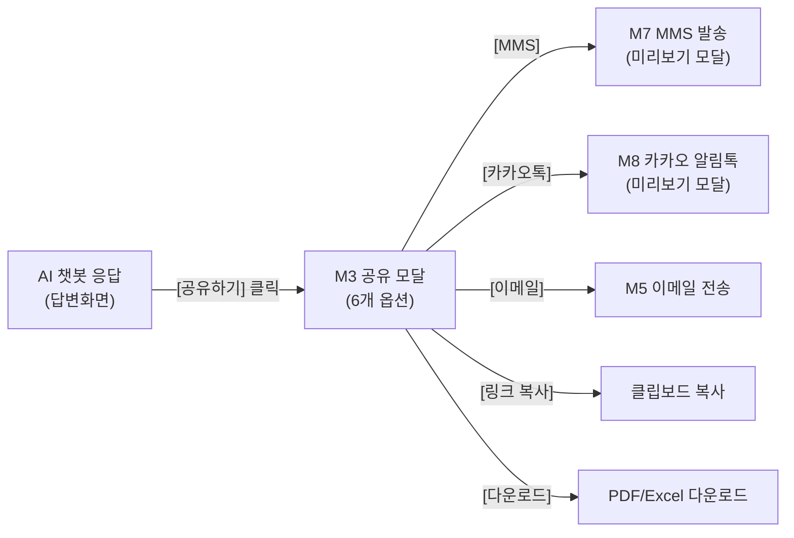
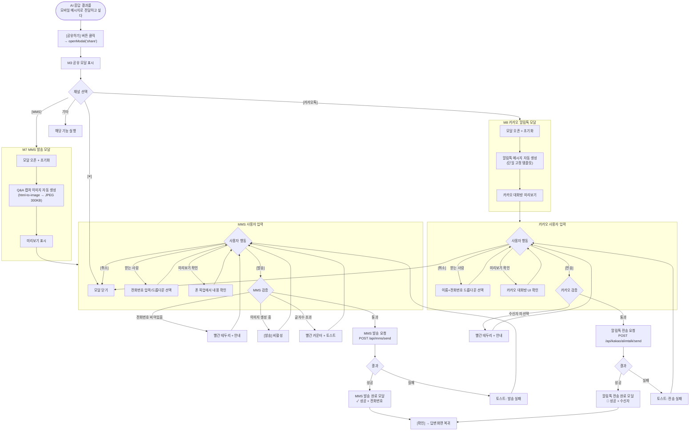
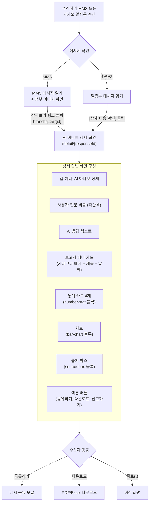
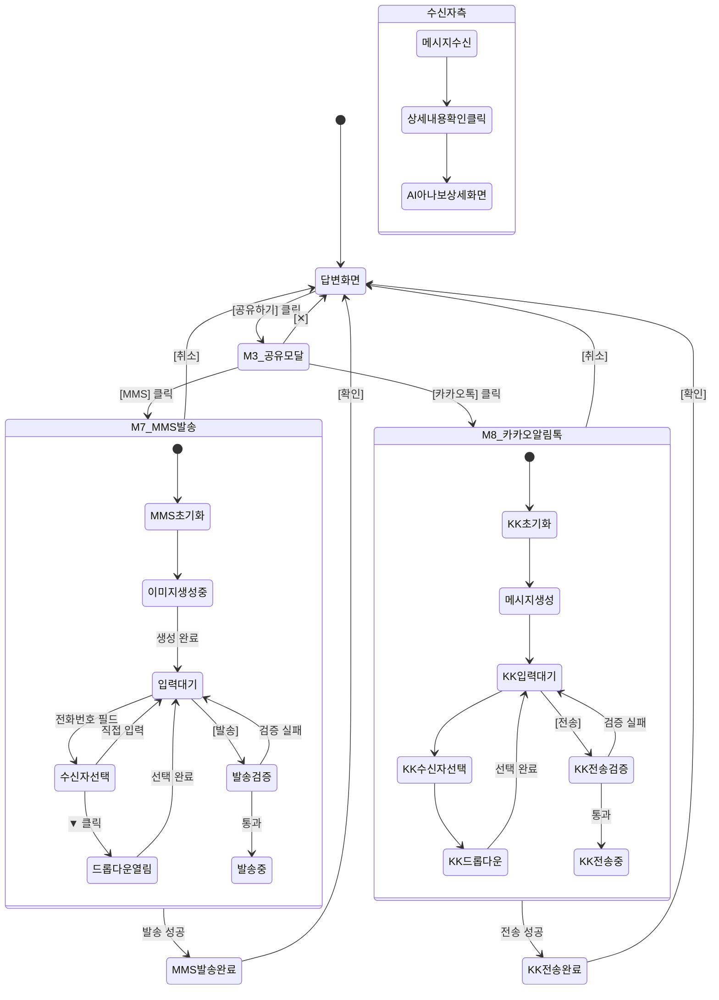
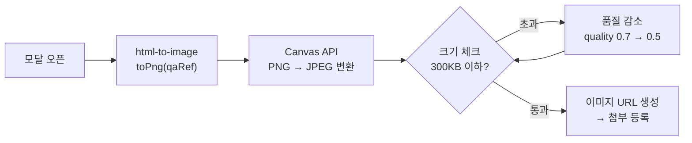
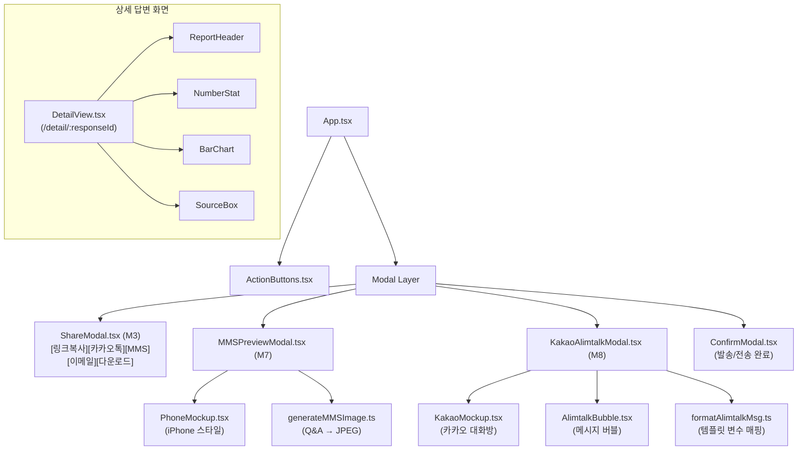

# BranchQ MMS 발송 / 카카오 알림톡 전송 업무흐름도

> 버전: 1.0 | 작성일: 2026.04.13
> 참조: 03_design_spec_v2.md (M3/M7/M8), Figma 4. 공유 기능 개발 페이지

---

## 1. 사용 의도

MMS 발송과 카카오 알림톡은 **AI 챗봇 응답 결과를 모바일 메시지로 전달**하는 기능이다. 수신자가 메시지 내 [상세 내용 확인] 버튼을 클릭하면 AI 아나보 상세 답변 화면으로 이동한다.

| 사용 동기 | 채널 | 예시 |
|----------|------|------|
| 분석 결과 즉시 알림 | 카카오 알림톡 | AI 분석 결과를 카카오톡으로 팀장에게 전송 |
| 이미지 포함 전달 | MMS | Q&A 답변 캡처 이미지를 MMS로 전송 |
| 앱 미설치 수신자 | MMS | 카카오톡 미설치 사용자에게 문자로 전달 |
| 상세 답변 공유 | 공통 | 상세 내용 확인 → AI 아나보 상세 화면 |

---

## 2. 진입 경로



---

## 3. 메인 업무흐름도



---

## 4. 수신자 측 흐름: 상세 내용 확인



---

## 5. 상태 다이어그램



---

## 6. MMS 발송 상세

### 6.1 MMS 메시지 구성

```typescript
interface MMSPayload {
  to: string;                    // 수신자 전화번호 "010-1234-5678"
  from: string;                  // 발신 번호 "02-1588-0000" (고정)
  subject: string;               // "[K-Branch] 예적금 현황 안내"
  body: string;                  // Q&A 답변 요약 텍스트 (2,000자 이하)
  imageUrl: string;              // Q&A 캡처 이미지 URL
  linkUrl: string;               // 상세보기 링크 "branchq.kr/r/{id}"
}
```

### 6.2 MMS 본문 자동 생성 규칙

```
[K-Branch] {보고서 제목}

안녕하세요. 요청하신 {질의 유형} 결과를 안내드립니다.

■ {통계1 라벨}: {값}
■ {통계2 라벨}: {값}
■ {통계3 라벨}: {값}

상세 내용은 첨부 이미지를 확인해주세요.
▶ 상세보기: branchq.kr/r/{responseId}
```

### 6.3 이미지 생성 흐름



---

## 7. 카카오 알림톡 상세

### 7.1 알림톡 페이로드

```typescript
interface AlimtalkPayload {
  templateCode: string;          // "TPL-001" (단일 고정)
  recipientNo: string;           // "01012345678"
  templateParam: {
    userName: string;            // "홍길동 팀장"
    question: string;            // 질문 요약
    answer: string;              // 답변 요약
    detailUrl: string;           // 상세보기 URL
  };
}
```

### 7.2 알림톡 메시지 템플릿 (고정)

```
[ AI하나로 ]
요청해 주신 질문에 대한 답변은 아래와 같습니다.

질문 : (#{question})
답변 : #{answer}

상세 내용은 아래 버튼에서 확인하세요.

[버튼] 상세 내용 확인 → #{detailUrl}
```

### 7.3 알림톡 미리보기 UI

```
┌─────────── 카카오톡 대화방 ───────────┐
│ 배경: #BFD9BA (연한 그린)             │
│                                       │
│ ┌─ 알림톡 도착 ─┐ (#FDE935 배지)     │
│                                       │
│ ┌─────────────────────────────────┐   │
│ │ [ AI하나로 ]                    │   │
│ │ 요청해 주신 질문에 대한 답변은  │   │
│ │ 아래와 같습니다.                │   │
│ │                                 │   │
│ │ 질문 : (...)                    │   │
│ │ 답변 : ...                      │   │
│ │                                 │   │
│ │ ┌──────────────────────────┐    │   │
│ │ │    상세 내용 확인         │    │   │
│ │ └──────────────────────────┘    │   │
│ └─────────────────────────────────┘   │
│                         오전 10:38    │
└───────────────────────────────────────┘
버블: #FFF8D1, CTA 버튼: #4876EB
```

---

## 8. 상세 내용 확인 → 답변 화면

### 8.1 라우팅

| 항목 | 값 |
|------|-----|
| URL | `/r/{signedToken}` 또는 `/detail/{responseId}` |
| 진입 | 알림톡 CTA 버튼 또는 MMS 상세보기 링크 |
| 처리 | **반응형 웹** (네이티브 앱 유도 없음, 바로 웹에서 확인) |
| 인증 | 서명 토큰 기반 (7일 유효, 읽기 전용) |

**설계 의도:**
- 모바일 앱 존재하지만, 이 경우 **링크 클릭 시 웹에서 바로 확인**
- 요약 뷰 우선 + 전체 보고서는 별도 확장
- 가로 스크롤 금지, 반응형 대응

### 8.2 반응형 브레이크포인트 (Mobile + Tablet)

| 뷰포트 | 대응 | 주요 특징 |
|-------|------|---------|
| **Mobile (375~767px)** | 요약 화면 | 2x2 통계, 세로 스택, Sticky 하단 CTA |
| **Tablet (768px+)** | 확장 화면 | 4열 통계, App Bar 액션, Callout + 전체보기 가로 분할 |

**범위 결정:** 데스크톱 전용 뷰는 제공하지 않음 (모바일 메시지에서 진입하는 시나리오가 주이므로 Mobile First + Tablet 확장으로 충분).
태블릿 이상의 데스크톱 환경에서는 태블릿 레이아웃을 그대로 사용하거나 max-width 컨테이너로 가운데 정렬.

### 8.3 모바일 요약 화면 구성 (Mobile First)

핵심: **가로 스크롤 없이** 주요 정보를 한 번에 파악

```
┌─ 모바일 (375px) ─────────────┐
│ 9:42                ●●● 🔋   │  ← 노치/Status Bar
│ ‹ AI 하나로            ⋯     │  ← App Bar
│   자금흐름 예상보고서        │
├──────────────────────────────┤
│ ┌─ Hero Card ──────────────┐ │
│ │ [예측] 2026.04.13 10:38  │ │
│ │ 자금흐름 예상보고서       │ │
│ │ 2026년 4~12월 예측 분석   │ │
│ │ 1~3월 실적 기반...        │ │
│ └──────────────────────────┘ │
│ ┌─ 통계 2x2 ──┐ ┌──────────┐ │
│ │ 예상 유입   │ │ 예상 유출 │ │
│ │ 52.3억      │ │ 47.1억    │ │
│ │ ▲ 8.2%     │ │ ▼ 3.5%   │ │
│ └─────────────┘ └──────────┘ │
│ ┌─ 차트 ────────────────────┐│
│ │ 월별 예상 자금흐름        ││
│ │ ▌▌▌▌▌▌▌▌▌ (4월~12월)     ││
│ └──────────────────────────┘ │
│ ┌─ Callout ────────────────┐ │
│ │ ⚠️ 주의: 6/8월 만기 집중 │ │
│ └──────────────────────────┘ │
│ [📊 전체 분석 보고서 보기 ›] │
│ 📋 출처: K-Branch          │
├──────────────────────────────┤
│  [📥 PDF 저장]   [📤 공유]   │  ← Sticky 하단 CTA (고정)
│      ─────                   │  ← Home Indicator
└──────────────────────────────┘
```

### 8.4 태블릿 화면 구성 (768px)

```
┌─ 태블릿 (768px) ───────────────────────────────────┐
│ ‹ AI 하나로                       [📥PDF][📤공유] │ ← App Bar (액션 통합)
│   자금흐름 예상보고서 · 2026.04.13                  │
├────────────────────────────────────────────────────┤
│ ┌─ Hero Card (full width 720px) ─────────────────┐ │
│ │ [예측] 2026.04.13 · 요청자: 홍길동 팀장         │ │
│ │ 자금흐름 예상보고서                              │ │
│ │ AI 요약 텍스트                                   │ │
│ └────────────────────────────────────────────────┘ │
│ ┌──────┐ ┌──────┐ ┌──────┐ ┌──────┐               │
│ │ 유입 │ │ 유출 │ │ 잔액 │ │ 만기 │ (4열 통계)  │
│ │52.3억│ │47.1억│ │5.2억 │ │ 8건  │               │
│ └──────┘ └──────┘ └──────┘ └──────┘               │
│ ┌─ 차트 (720x180) ────────────────────────────────┐│
│ │ ▌▌▌▌▌▌▌▌▌ (9개월, 막대 두께 24px)              ││
│ └────────────────────────────────────────────────┘ │
│ ┌─ Callout (50%) ──┐ ┌─ 전체 보고서 (50%) ──────┐ │
│ │ ⚠️ 6/8월 만기   │ │ 📊 전체 분석 보고서  ›   │ │
│ └─────────────────┘ └──────────────────────────┘ │
│ 📋 출처 정보 (한 줄)                               │
└────────────────────────────────────────────────────┘
```

**모바일 → 태블릿 변환 규칙:**
- 통계: 2x2 그리드 → 1x4 가로
- 차트: 막대 두께/높이 ↑
- Callout / [전체보기]: 세로 스택 → 50% 가로 분할
- Sticky CTA → App Bar 우측 통합 (모바일 한정)
- 폰트 사이즈: 전체 +1~2px
- Card 패딩: 14px → 20~24px

```
┌─────────────────────────────────┐
│ ‹  AI 아나보 상세            ✕ │  ← 앱 헤더
├─────────────────────────────────┤
│                                 │
│  [사용자 질문 버블] ──── 파란색 │
│                                 │
│  AI 응답 텍스트                 │
│                                 │
│  ┌─ 보고서 헤더 ─────────────┐ │
│  │ [카테고리 배지] 예측       │ │
│  │ 자금흐름 예상보고서        │ │
│  │ 2026년 4~12월 예측 분석    │ │
│  │ 생성일시: 2026.04.13      │ │
│  └───────────────────────────┘ │
│                                 │
│  [통계카드] [통계카드]          │
│  [통계카드] [통계카드]          │
│                                 │
│  ┌─ 월별 자금흐름 예측 차트 ─┐ │
│  │ 4월 ████████               │ │
│  │ 5월 ██████                 │ │
│  │ 6월 █████████              │ │
│  └───────────────────────────┘ │
│                                 │
│  📋 출처: K-Branch 시스템      │
│                                 │
│  [공유하기] [다운로드] [신고]   │
└─────────────────────────────────┘
```

### 8.5 데이터 로드

```typescript
// 상세 화면 진입 시
const response = await fetch(`/api/responses/${responseId}`);
const data: AIResponse = await response.json();

// data.blocks 배열을 순서대로 렌더링
// report-header → number-stat → bar-chart → source-box
```

---

## 9. 수신자 선택 드롭다운

### MMS 전화번호 드롭다운

| 항목 | 값 |
|------|-----|
| 데이터 | 사내 연락처 API (이름 + 전화번호) |
| 선택 UI | 아바타 + 이름 + 전화번호 |
| 직접 입력 | "전화번호 직접 입력..." 옵션 |
| 검증 | 010-XXXX-XXXX 형식 체크 |

### 카카오 받는 사람 드롭다운

| 항목 | 값 |
|------|-----|
| 데이터 | 사내 연락처 + 카카오 등록 여부 |
| 선택 UI | 아바타 + 이름 + [카톡] 배지 + 전화번호 |
| 미등록 | "카톡 미등록" 빨간 표시 (선택 불가) |
| 검색 | 이름 또는 전화번호 검색 필드 |

---

## 10. 에러 처리

| 상황 | 채널 | 대응 |
|------|------|------|
| 전화번호 형식 오류 | MMS | 빨간 테두리 + "올바른 전화번호를 입력하세요" |
| 글자수 2,000자 초과 | MMS | 빨간 카운터 + 토스트 |
| 이미지 300KB 초과 | MMS | 자동 리사이즈 → 재시도 |
| 이미지 생성 실패 | MMS | 토스트 + [발송] 비활성 |
| MMS 발송 실패 | MMS | 토스트: "MMS 발송에 실패했습니다" |
| 수신자 미선택 | 카카오 | 빨간 테두리 + 안내 |
| 카카오 API 실패 | 카카오 | 토스트: "카카오 연동을 확인해주세요" |
| 알림톡 발송 실패 | 카카오 | 토스트 + 모달 유지 |
| 딥링크 실패 | 공통 | 웹 브라우저 fallback |
| 네트워크 오류 | 공통 | 토스트: "네트워크 연결을 확인해주세요" |

---

## 11. 컴포넌트 구조



---

## 12. 파일 구조

```
src/
├── components/
│   ├── modals/
│   │   ├── MMSPreviewModal.tsx        # M7: MMS 미리보기
│   │   ├── KakaoAlimtalkModal.tsx     # M8: 카카오 알림톡 미리보기
│   │   └── ConfirmModal.tsx           # 발송/전송 완료
│   └── share/
│       ├── PhoneMockup.tsx            # 공통 iPhone 스타일 폰 목업
│       ├── KakaoMockup.tsx            # 카카오 대화방 목업
│       └── AlimtalkBubble.tsx         # 알림톡 메시지 버블
├── pages/
│   └── DetailView.tsx                 # 상세 답변 화면
├── utils/
│   ├── generateMMSImage.ts            # Q&A → JPEG (300KB 이하)
│   └── formatAlimtalkMsg.ts           # 블록 데이터 → 알림톡 메시지
├── types/
│   └── share.ts                       # MMSPayload, AlimtalkPayload
└── api/
    ├── mms.ts                         # POST /api/mms/send
    └── kakaoAlimtalk.ts               # POST /api/kakao/alimtalk/send
```

---

## 13. 디자인 토큰

| 요소 | 스펙 |
|------|------|
| 폰 목업 | `w-280~340`, `rounded-[32px]`, `stroke-3 gray-300` |
| 노치 | 9:41, 배터리 아이콘, 다이나믹 아일랜드 |
| 홈 인디케이터 | `w-120 h-4 rounded-full gray-300` |
| MMS 버블 | `bg-gray-200`, `rounded-2xl`, `p-3.5` |
| 카카오 배경 | `bg-[#BFD9BA]` |
| 알림톡 배지 | `bg-[#FDE935]`, `text-[#3D2907]`, `rounded-sm` |
| 알림톡 버블 | `bg-[#FFF8D1]`, `rounded-xl` |
| CTA 버튼 | `bg-[#4876EB]`, `text-white`, `rounded-lg` |
| 전송 버튼 (카카오) | `bg-[#FDE935]`, `text-[#3D2907]` |
| 발송 버튼 (MMS) | `bg-primary-blue`, `text-white` |
| 전송완료 아이콘 | MMS: `✓` green, 카카오: `💬` yellow |
| 폰트 | 한글: Noto Sans KR, 숫자: Inter |

---

## 14. 상세 화면 액션 구현 (PDF 저장 / 공유)

### 14.1 PDF 저장

**권장 방식: 서버 사이드 (Puppeteer 또는 WeasyPrint)**

| 방식 | 장점 | 단점 | 품질 |
|------|------|------|------|
| 서버 사이드 (Puppeteer) | 고품질, 텍스트 검색 가능, 일관된 렌더링 | 서버 비용, 2~5초 소요 | ⭐⭐⭐⭐⭐ |
| 클라이언트 (html2pdf.js) | 서버 부담 없음, 빠름 | 이미지 기반, 해상도 이슈, iOS 제약 | ⭐⭐ |
| 브라우저 인쇄 (window.print) | 사용자 친화적 | UI 제거 위해 @media print 필요 | ⭐⭐⭐ |

**API 설계:**
```
POST /api/reports/{id}/pdf
Response: { pdfUrl: "...", expiresAt: "2026-04-20T..." }

Client:
  if (iOS) window.open(pdfUrl, '_blank')  // 새 탭에서 사용자 수동 저장
  else { /* download trigger */ }
```

**플랫폼별 제약:**
- iOS Safari: 자동 다운로드 차단 → 새 탭 + 사용자 수동 저장
- Android Chrome: 자동 다운로드 가능
- 데스크톱: 자동 다운로드 가능

### 14.2 공유 (Web Share API)

**권장 방식: navigator.share() + Fallback**

```javascript
async function handleShare() {
  const url = `https://branchq.kr/r/${signedToken}`;

  if (navigator.share) {
    try {
      await navigator.share({
        title: '자금흐름 예상보고서',
        text: 'AI 하나로가 생성한 보고서입니다',
        url: url
      });
    } catch (e) {
      if (e.name !== 'AbortError') console.error(e);
    }
  } else {
    // Fallback: 클립보드 복사
    await navigator.clipboard.writeText(url);
    showToast('링크가 복사되었습니다');
  }
}
```

**플랫폼별 동작:**

| 플랫폼 | navigator.share | 결과 |
|--------|----------------|------|
| iOS Safari 14+ | ✅ | 네이티브 공유 시트 (카톡/메시지/에어드롭) |
| Android Chrome | ✅ | 네이티브 공유 시트 |
| 데스크톱 Chrome 89+ | ⚠️ 제한 | Email, Bluetooth만 |
| 데스크톱 Safari | ✅ | 시스템 공유 시트 |
| 기타 | ❌ | 클립보드 fallback |

**필수 조건:**
- HTTPS 환경만 작동
- 사용자 제스처(클릭 이벤트) 내에서 호출

### 14.3 보안 / 링크 정책

| 항목 | 정책 |
|------|------|
| 링크 형식 | `/r/{signedToken}` (HMAC 또는 JWT 서명) |
| 유효 기간 | 7일 (설정 가능) |
| 인증 | 비인증 접근 가능 (수신자 편의) |
| 권한 | 읽기 전용 (수정 불가) |
| 민감 데이터 | 계좌번호 마스킹 (1234-**-****) |
| 만료 후 | 410 Gone + "링크가 만료되었습니다" |
| 감사 로그 | 다운로드/공유 이력 기록 |

### 14.4 성능 / 비용

| 항목 | 예상 |
|------|------|
| PDF 생성 시간 | 2~5초 (보고서 복잡도에 따라) |
| 서버 메모리 | 동시 100건 기준 2GB |
| 캐싱 | 동일 보고서 1시간 TTL |
| 큐 시스템 | Redis/BullMQ로 비동기 처리 |
| 월 1만건 인프라 비용 | $50~100 수준 (Puppeteer 서버 + CDN) |

**대응 전략:**
- 5초 이하: 로딩 모달 + 즉시 응답
- 5초 이상: "완료 시 알림" 토스트 + 백그라운드 처리

### 14.5 구현 가능성 결론

✅ **모든 기능 실제 구현 가능** — 대부분 금융/기업 앱에서 이미 사용 중인 검증된 기술

**Phase 1 최소 구현 (MVP):**
- Web Share API + 클립보드 fallback
- 서버 사이드 PDF (Puppeteer)
- 7일 유효 토큰 링크
- 기본 마스킹 (계좌번호)

**Phase 2 확장:**
- 카카오톡 공유 전용 최적화 (sharekakaoTalk SDK)
- 이메일 발송 연동 (SES, SendGrid)
- 워터마크, 열람 추적
- 접근 권한 세분화 (특정 도메인만 허용 등)

**미리 결정 필요한 항목:**
1. 링크 인증 정책: 공개 토큰 vs 로그인 필요
2. PDF 서버 인프라: 자체 구축 vs SaaS (CloudConvert)
3. 보안 요구사항: 워터마크, 만료 기간, 마스킹 범위
4. 분석 추적: 수신자 열람 여부 기록 여부

---

## 15. 향후 확장

| 기능 | 설명 | 우선순위 |
|------|------|---------|
| 다중 수신자 | 여러 명에게 동시 발송 (태그 형태) | Phase 2 |
| 발송 이력 | 보낸 메시지 목록 조회 | Phase 2 |
| 예약 발송 | 지정 시간에 자동 발송 | Phase 3 |
| 카카오 친구톡 | 광고 메시지 (이미지 포함) | Phase 3 |
| 푸시 알림 | 앱 푸시 + 인앱 메시지 | Phase 2 |
| 읽음 확인 | 수신자 열람 여부 추적 | Phase 3 |
